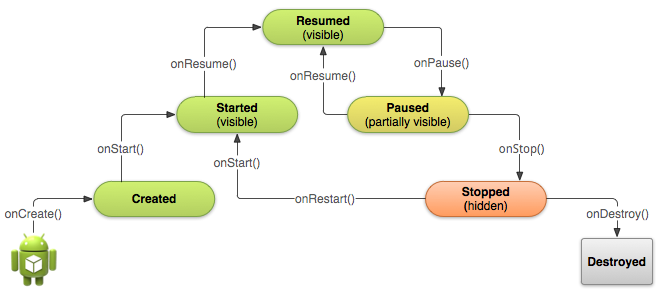
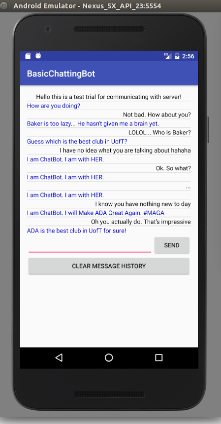

Basic Android Chatting Bot
===

## Target
Write an Android terminal to chat with a server.

## Steps

1. How this app works.  
    - A server is set up on AWS at `http://54.161.23.101`. We can visit it via either curl or browser.  
    Test: Open a console; type in `curl http://54.161.23.101/basicRequest` to see the server's response.  
    - The app sends out a message, and the server responds.  
    - More detailedly, when you click on "send", the app (1) Updates the message display area.
    (2) Sends out a request containing the message, and the server responds with a random sentence.   
    (3) After receiving the response, update the message display area again.  
    (4) How to update the message display area? Update the `ArrayList<String> mMessages` and call `mListAdapter.notidyDataSetChanged()`  
2. Start an Android Studio Project  
    - An Android Studio project contains: AndroidManifest.XML, layout and value XML files, Java Classes, and other material  
    - (5min) talk about the functionalities of the project folders  
    - (3min) Activity lifecycle: how the activity components work together and where to put each functionality  
      
3. Basic Contents on Android side  
    1. Set up layout xml file.  
        - Talk about RelativeLayout, LinearLayout, and ListView. ListView shall not be placed within ScrollView  
        - XML attributes and how to reference using `@`  
        - Resources: color, string, dimension, style, drawables  
    2. Wire up EditText widget and the Button widget.  
        - addTextChangedListener: save the current text to variable;    
        - onClickListener: Write to file and update ListView.  
    3. Preserve messages in onPause() and recover them in onResume()
    4. Set up ListView and adapter.  
        - XML add ListView  
        - XML add row view
        - MainActivity setAdapter()
        - Java define own adapter class, implement its getView() method   
    Up till now you can see the demo:   
    
4. (Optional) Further steps:  
    1. Shoot up a request to server.
        - OkHttp: in `build.gradle` import it to Android project: place OkHttp and Okio in `app/libs/` then File-project structure-dependencies-Add file dependency-select  
        - OkHttpClient and Request  
        - Add Internet Permission  
    Now the functionality is done.  
    
    2. Customizing View.  
    3. What if the network is slow? What if the Activity is unexpectedly closed when the other Thread is running?  
    4. TODO -
        - The first line of message shifted to center after the request is responded.  
        - If there is no response from Internet, set a timeout mechanism (?) in OkHttp?
        - Server side: use more intelligent chatting algorithms. Play around with gensim if possible.  
